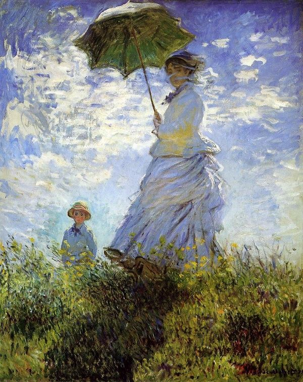
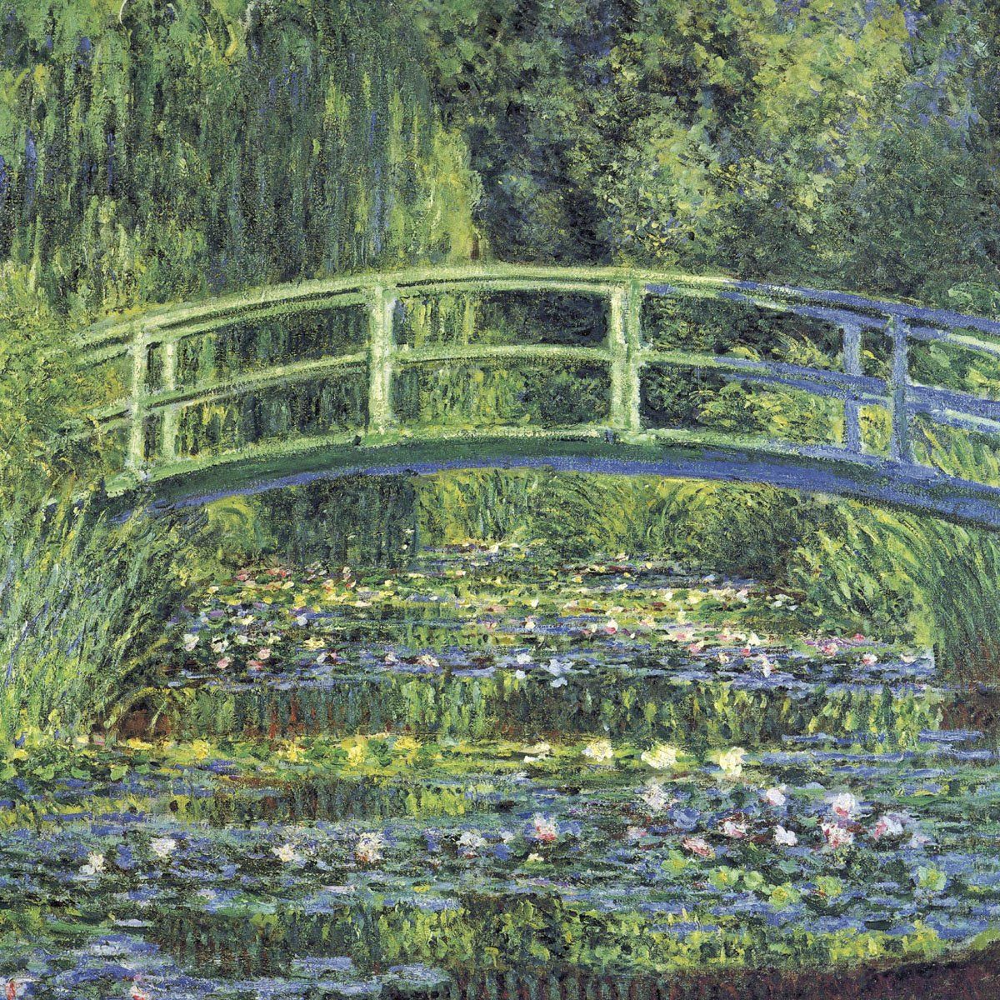

---
# set the layout to use, in this case, the homepage one
layout: layouts/homepage

# set the page title
title: Claude Monet

# We can set extra info here to use in our templates

t1:
    title: " Impressionist painting"
------------------------------------------------------------

### Oscar Claude Monet 

Oscar Claude Monet (14 November 1840 -- 5 December 1926) was a French painter, one of the founders of impressionism. The term impression is derived from Impression Sunrise, which monet and his colleagues exhibited in their first independent exhibition in 1874.

Monet is good at the experimental and expressive techniques of light and shadow. The most important style of monet is to change the painting method of shadow and outline. There is no very clear shadow in his paintings, nor highlight or flat outline. In addition, he is quite delicate in the use of color. He has long explored the perfect expression of color and light in experiments, and often painted multiple pictures of the same object at different times and under light.

Monet's ambition to document the French countryside led him to adopt the method of painting the same scene many times to capture the changing light and the passing of the seasons. From 1883 monet lived in Giverny, where he bought houses and property and began a major beautification project, including the lily pool that would later become the subject of his work. He began painting water lilies in 1899, first with a vertical view centered on Nihonbashi, and then with a series of large-scale paintings over a period of 20 years.

### Woman with a Parasol - Madame Monet and Her Son, 1875, National Gallery of Art, Washington, D.C

The composition of this painting is on the upper side. The boy on the left and the woman holding an umbrella form a triangular composition to balance the picture. The main colors are green, blue and brown, and the colors are fresh and bright. The colors of the clothes of the characters are unified with the background, without clear shadows and Outlines. The brush strokes are bold and random, and the direction of the skirt and grass is full of dynamic.

The whole picture gives people the feeling of a hazy dream scene. The author skillfully distinguishes the spatial relationship between women, children and the sky with the method of size proportion and covering, which is well expressed. He has a good grasp of light and shadow and the sense of instant impressions in his paintings. Painting women face and upper body use darker color, that is in the shadow of parasols, while the parasols, face, dress, and shadows on the lawn area, and a woman dress to the light side of the light contrast (son), women on headscarves and long skirt crepe fold has strengthened the screen to move feeling.

Monet, more than any other painter, focused on capturing ephemeral images without paying attention to the contours of objects themselves. "Light is the main character in the painting," he said. He describes his efforts to paint "the beauty of air... But that's impossible." Monet devoted his life to painting what couldn't be painted, and in this painting there are clouds passing through the sky, and we can almost feel the breeze that carries them.

### Water Lilies and the Japanese Bridge, 1897–1899, Princeton University Art Museum
An arched wooden bridge in Japanese style, painted green, crosses the pond; Water calamus, lily, rhododendron ornamentals and hydrangea surround and protect the pond. Pink water lilies float on the water. Willows and wisteria spill over the water, making it darker and bluer. It wasn't until 1895 that Monet painted his first picture of a pond and Nihonbashi. Starting in 1898, he painted several more versions of squares on the same subject, a dozen of which were shown in a new exhibition of his works at the Duran-Luel Gallery.